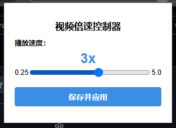

# Video Speed Controller Chrome Extension

A simple Chrome extension that allows you to set a fixed playback speed for all HTML5 videos across all websites.

## Features

- Set a global playback speed for all videos (from 0.25x to 5.0x)
- Settings are automatically applied to all websites
- Settings persist across browser sessions
- No images used in the extension
- Works with dynamically loaded videos

## Installation

1. Download or clone this repository to your computer
2. Open Chrome and navigate to `chrome://extensions/`
3. Enable "Developer mode" in the top right corner
4. Click "Load unpacked" and select the folder containing the extension files
5. The extension should now be installed and active

## Usage

1. Click on the extension icon in the Chrome toolbar
2. Use the slider to select your desired playback speed
3. Click "Save and Apply" to set the speed
4. The selected speed will be applied to all videos on all websites automatically
5. Your settings will be preserved even after closing and reopening Chrome

## Troubleshooting

If a video isn't playing at your selected speed:

- Try refreshing the page
- Check if the website is using a custom video player that might override our settings
- For embedded videos (like YouTube in iframes), the extension might have limited effect

## Technical Details

This extension works by:
1. Using content scripts to detect video elements on web pages
2. Setting their playback rate to your preferred speed
3. Adding event listeners to maintain the speed if the website tries to change it
4. Using MutationObserver to detect new videos added to the page dynamically
5. Storing settings in Chrome's sync storage for persistence across sessions 